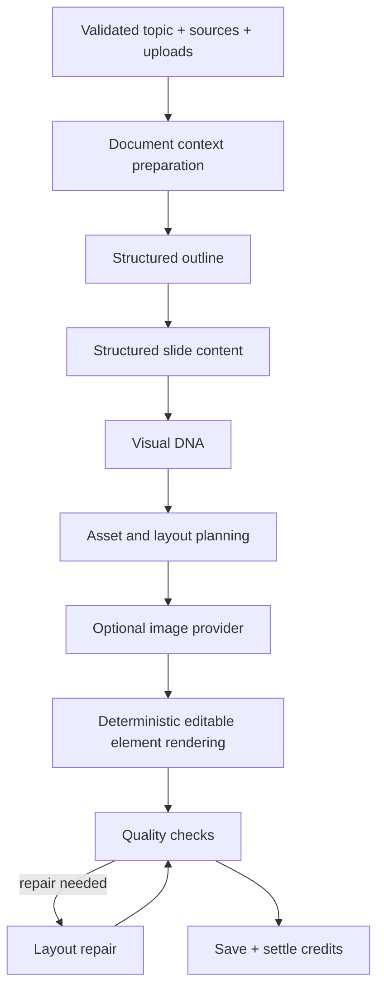

# AI generation pipeline

Generation is a staged, observable job rather than one large prompt.

`generate-presentation` authenticates the user, validates owned assets, calls the atomic reservation RPC, and runs the pipeline in the background. Each stage updates `generation_steps` and job progress for Realtime/polling clients. A failure keeps the presentation record, marks the job with a safe error, and releases reserved credits. Retry creates a new idempotent job.

## Structured model calls

Outline, content and editor commands use strict JSON schemas through the Responses API. Provider calls record model, token counts, generated image count, latency and estimated cost in `ai_usage`. Pricing snapshots live in `app_settings` and can be changed through the audited admin console.

The text and image clients are adapters. The default text model is configurable with `OPENAI_TEXT_MODEL`; image generation uses the requested `gpt-image-1.5` through an `ImageProvider` abstraction, so a later provider can be added without changing layout or billing code.

## Visual DNA and quality

One Visual DNA object establishes mood, era, palette, typography, texture, illustration direction, icon language, spacing and chart language for the whole deck. The deterministic layout engine turns structured slide plans into independent, editable text/image/shape/chart/table elements on a 1000 × 562.5 canvas.

The quality pass checks bounds, overlap risk, readable text sizes, contrast assumptions, density and missing required content. Repair adjusts layout before a deck can become `ready`.

## Uploaded source privacy

User uploads stay in private Storage. For supported text documents, the worker creates a short-lived provider file only when necessary and deletes it in `finally`. Generated assets return to private Storage. Provider keys and service-role access exist only in the Edge runtime.

## Mock and production modes

Mock generation is enabled only when the server environment explicitly sets `GENERATION_MODE=mock`. It exercises the real database, credits, progress, editor and export paths without provider calls. `GENERATION_MODE=real` fails safely when `OPENAI_API_KEY` is absent; it never silently substitutes fake content in production.

## O‘yingoh question generation

`generate-game` is a single structured call rather than a staged job: a quiz is
small enough to write at once, and the editor — not a progress bar — is where the
value is added. One flat JSON schema covers every authorable type, and a mapper
turns each row into the per-type `config` the grader understands, rejecting rows
whose fields contradict their type. `image_quiz` and `hotspot` are deliberately
absent from the schema: they need a picture the model does not have, so they are
added by hand.

Every generated question lands as an editable draft and the game as `draft`
status. There is no path that puts model output in front of a room without a
person having been able to change it.

`mode: "regenerate"` rewrites exactly one question, keyed by id, so re-rolling a
bad question costs one question rather than twenty. Both modes log to `ai_usage`
under `game_generation` / `game_question_regeneration`, which is where the admin
console reads O‘yingoh cost from, and both are rate limited per account through
`api_rate_limits`.

Games generated from a presentation pass the deck's own text as the source with
an instruction to use nothing else, which is the whole reason that flow exists:
the questions have to be about what the room just watched.
