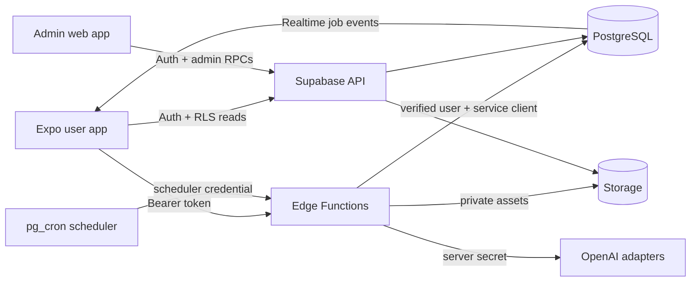

# System architecture

Jaxongirman treats mobile, admin and Supabase as one release unit. Public clients use only the Supabase URL and anon/publishable key. Every privileged operation is enforced in PostgreSQL or an Edge Function.

## Trust boundaries

- Expo and Vite are untrusted clients. They never receive `SUPABASE_SERVICE_ROLE_KEY`, `OPENAI_API_KEY`, database credentials, or provider secrets.
- RLS owns read isolation. A user can select only rows whose `owner_id` is their authenticated ID; dependent slide/element records also use owner-consistent composite foreign keys.
- Admin authorization is a database role checked with `is_admin(auth.uid())`. Admin writes are security-definer RPCs that validate inputs and append an audit record in the same transaction.
- Edge Functions manually verify the bearer token through Supabase Auth, reject blocked users, validate presentation ownership, and use the service role only inside the server runtime.
- Storage buckets are private. Object paths start with the user's UUID, policies enforce that prefix, and downloads use short-lived signed URLs.

## Application surfaces

The mobile flow is email/password auth → recent presentations and wallet → topic/file create form → live generation steps → element editor → asynchronous PDF or editable PowerPoint export. Export jobs report progress, write to private Storage, and are downloaded through short-lived authenticated URLs. The editor persists atomic operations and inverse history, while local state provides immediate interaction.

The admin flow is email/password auth → server role check → operational dashboard. It exposes user credit/status controls, presentation diagnostics, AI usage/cost, style/package/operation pricing, runtime settings and audit history.

## Release synchronization

Database migrations are the source of truth. After schema changes, regenerate `packages/types/src/database.generated.ts`, typecheck both clients, test RLS/credit behavior, and deploy functions built against the same migration set. Remote deployment is forward-only.
