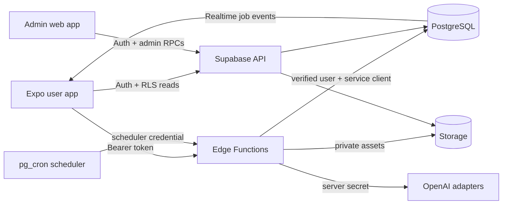
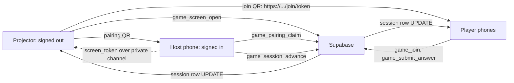

# System architecture

Jaxongirman treats mobile, admin and Supabase as one release unit. Public clients use only the Supabase URL and anon/publishable key. Every privileged operation is enforced in PostgreSQL or an Edge Function.

## Trust boundaries

- Expo and Vite are untrusted clients. They never receive `SUPABASE_SERVICE_ROLE_KEY`, `OPENAI_API_KEY`, database credentials, or provider secrets.
- RLS owns read isolation. A user can select only rows whose `owner_id` is their authenticated ID; dependent slide/element records also use owner-consistent composite foreign keys.
- Admin authorization is a database role checked with `is_admin(auth.uid())`. Admin writes are security-definer RPCs that validate inputs and append an audit record in the same transaction.
- Edge Functions manually verify the bearer token through Supabase Auth, reject blocked users, validate presentation ownership, and use the service role only inside the server runtime.
- Storage buckets are private. Object paths start with the user's UUID, policies enforce that prefix, and downloads use short-lived signed URLs.

## Application surfaces

The mobile flow is email/password auth → recent presentations and wallet → topic/file create form → live generation steps → element editor → asynchronous PDF or editable PowerPoint export. Export jobs report progress, write to private Storage, and are downloaded through short-lived authenticated URLs. The editor persists atomic operations and inverse history, while local state provides immediate interaction.

## O‘yingoh surfaces

A live match spans three devices, and the trust model is the presentation
pairing model reused rather than reinvented. A projector opens an unclaimed
session while signed out and receives three independent capabilities exactly
once: a rotating single-use pairing code, a screen token stored only as a
SHA-256 digest, and a private realtime channel name. The phone that scans the
pairing code becomes the only device that can drive the match. The room scans a
*different* QR — an `https://<domain>/join/<token>` universal link, public to
everyone physically present and unguessable to everyone else.

Realtime publishes only `game_sessions`. Every screen refetches its own
sanitised state when `state_version` moves, so a hundred phones carry a hundred
small payloads rather than one broadcast that would have to contain answers.

A deck that finishes becomes a match: `presentation_launch_game()` mints a game
session, and the host's phone hands the raw screen token to the projector over
the presentation's private broadcast channel — the same projector, a different
show, with nobody signing in on it.

The public domain is configuration, not a literal: `NEXT_PUBLIC_APP_URL`
(see `web/lib/public-url.ts`) decides what the join QR points at, so moving to
`jaxongirman.app` is an env change plus the two association files under
`web/public/.well-known/`. Because the association can silently fail — a wrong
Team ID, a CDN cache, an OS that ignores it — the landing page always prints the
six-digit join code, and typing it is a first-class path rather than a fallback.

The admin flow is email/password auth → server role check → operational dashboard. It exposes user credit/status controls, presentation diagnostics, AI usage/cost, style/package/operation pricing, runtime settings, O‘yingoh curation and live-match supervision, and audit history.

## Release synchronization

Database migrations are the source of truth. After schema changes, regenerate `packages/types/src/database.generated.ts`, typecheck both clients, test RLS/credit behavior, and deploy functions built against the same migration set. Remote deployment is forward-only.

## Talabalar marafoni

The marathon is a whole feature that ships switched off. `student_marathon_enabled`
governs every user-facing surface — the vote button on four screens, the home
poster, the profile section, the vote search, the vote mutation and the market —
while an administrator writes campaigns, uploads posters, prices floors and
rehearses the reward ladder behind it. Turning it on is one button in the console
with one confirmation, and it is the only thing that turns it on: no migration,
no deploy and no test may.

The launch procedure is the console's own order: create the campaign, upload a
2.35:1 poster (cropped in the browser, previewed at desktop and mobile widths),
check the wording, set a 30-day window, check the ladder, decide whether the vote
market opens with it, then press **Marafonni ishga tushirish**. The function
refuses a campaign with no poster, no ladder, a date already past, or another
marathon already running, and writes the launch to the audit log. Ending one
takes the marathon off the app the same way.

Money reuses the order engine rather than adding a second payment path: a vote
purchase is an order with its own purpose, its own 12/12 commission scope, and a
fulfilment branch that transfers the votes. What it cannot reuse is the design
marketplace's settlement — those tables are bound to products and purchases — so
marathon payouts are reconciled from `marathon_vote_sales` in the console.

Countdowns are drawn against the server's clock. Every campaign read carries
`now()`, the client measures its own error once per load and ticks from there, so
a phone whose date is wrong is not told the marathon closed.
