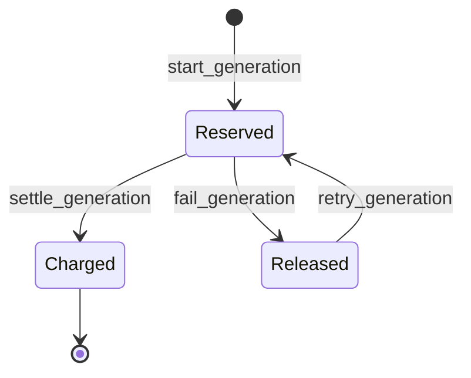
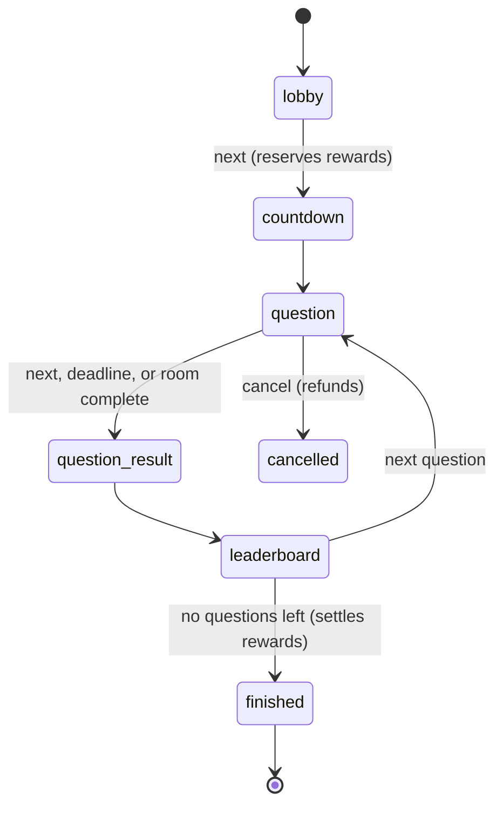
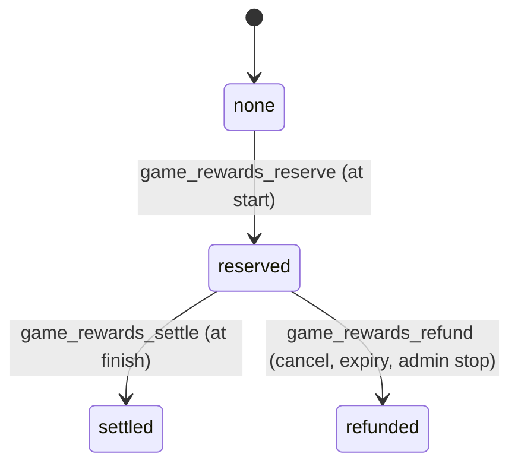

# Database and security model

## Core records

- Identity: `profiles`, `user_roles`
- Presentations: `presentations`, `slides`, `slide_elements`, `presentation_assets`, `presentation_sources`
- Generation: `generation_jobs`, `generation_steps`, `ai_usage`, `api_rate_limits`
- Billing: `credit_wallets`, immutable `credit_transactions`, database-driven `style_configs` and `app_settings`
- Delivery: `export_jobs`, `presentation_edit_history`
- O‘yingoh: `games`, `game_questions`, `game_sessions`, `game_players`, `game_answers`, `game_categories` (see below)
- Governance: immutable `admin_audit_logs`

All user-facing records use UUIDs, timestamps, constraints and indexed foreign keys. Presentation children store both presentation and owner IDs and use composite relationships so records cannot be attached across owners.

## Credit transaction lifecycle

`start_generation` locks the wallet, estimates cost from active style configuration, checks available balance, creates a reservation transaction, and returns the job. Its idempotency key prevents duplicate reservations. Success settles the reservation against actual credits; failure releases it. Wallet and ledger changes occur atomically in PostgreSQL.

Admins adjust credit through `admin_adjust_credits`, which locks the wallet, prevents negative available balance, writes an immutable transaction, and writes `admin_audit_logs` before commit.

## RLS matrix

| Data | User | Admin | Service role |
|---|---|---|---|
| Own presentation graph | Select own rows | Select all | Server pipeline |
| Own wallet/ledger | Select own rows | Select all | Atomic functions |
| AI/export/edit records | Select own rows | Select all | Workers |
| Styles/public settings | Select active/public | Select all | Workers |
| User roles/audit | Own role / no audit | Select all | Governance |

Direct client inserts/updates are minimized. Generation, editing, exports and billing use checked RPCs or Edge Functions. Admin privileges never come from client claims or hidden UI.

## Data collection

The survey module adds its own tables, policies and functions; see
[data collection](data-collection.md) for the full contract. Two properties cut
across the schema and belong here: a response is written only by
`submit_survey_response()` — clients hold no INSERT privilege on
`survey_responses` or `survey_answers` — and every response carries an
`expires_at` that a scheduled sweep enforces. Admins can read a survey's
metadata for moderation and cannot read its answers at all.

## Storage

Private buckets are migrated and reproducible: `user-uploads`, `presentation-assets`, `generated-images`, `exports`, `thumbnails`, and `survey-uploads` (3 MB, images only, paths shaped `<respondent_id>/<form_id>/<file>`). Bucket-specific MIME and size constraints apply. User policies require paths shaped as `<auth.uid()>/...`; server outputs follow the same convention.

`game-assets` is the one public bucket, deliberately: a question image is quiz
content shown to a whole room including a signed-out projector, and paths are
unguessable UUIDs under the owner's folder. Writes still require the owner's
prefix. Nothing personal lands there — private documents keep living in the
private buckets.

## Migration safety

Replay locally with `npx supabase db reset --local`. Validate with `npx supabase db lint --local --level warning` and `npx supabase test db`. Never use reset against a linked remote project; ship reviewed forward migrations with `db push`.

## O‘yingoh

- Content: `game_categories`, `games`, `game_questions`
- Live matches: `game_sessions`, `game_pairing_tokens`, `game_players`, `game_answers`
- Commerce: `marketplace_products.game_id` (a game listing carries no file — it
  references the game row, and `purchase_entitlements` is what grants hosting)

`game_questions.config` is the answer key, so no player-facing path selects that
table: RLS grants SELECT to the owner alone. Players receive questions through
`game_player_state()` and projectors through `game_screen_snapshot()`, both of
which call `game_sanitized_question()` — it strips the key and shuffles the
orderable and matchable options with a per-session seed, so every device agrees
on the same scramble without being told the answer.

The server owns the clock and the score. `game_sessions.phase_deadline` is
written by `game_session_advance()`, answers past it are rejected, and
`game_grade_answer()` computes the speed bonus from `now()` against
`question_started_at`. A client that submits a score is not a client this schema
has a path for. `unique (session_id, player_id, question_id)` is the whole of
the "one answer per question" rule; the submit RPC returns the same success for
a replay and never returns the verdict, so a fast thumb cannot broadcast the
answer to the room.

### Match state machine

`game_session_advance()` is the only writer, and every other transition raises.
`finished → question` is impossible by construction rather than by convention.

### Reward lifecycle

The hold is `game_reward_liability(plan, player_count)` — the most the plan could
ever pay for the lobby as it stands when the host presses start — moved from
`balance` into `reserved` on the same wallet the generation pipeline uses. A plan
the balance cannot cover refuses to start the match, so "balans yetmaydi" can
only ever happen before the first question.

Settlement pays only `game_players.reward_eligible` rows, and decides the podium
by rank *among them*. That is what keeps the payout inside the hold: somebody who
joins during question three ranks on the podium screen but was not priced into
the hold, so they cannot enlarge it. Every movement carries an idempotency key
derived from the session id, which is why a retried settlement is a no-op rather
than a second payout.
