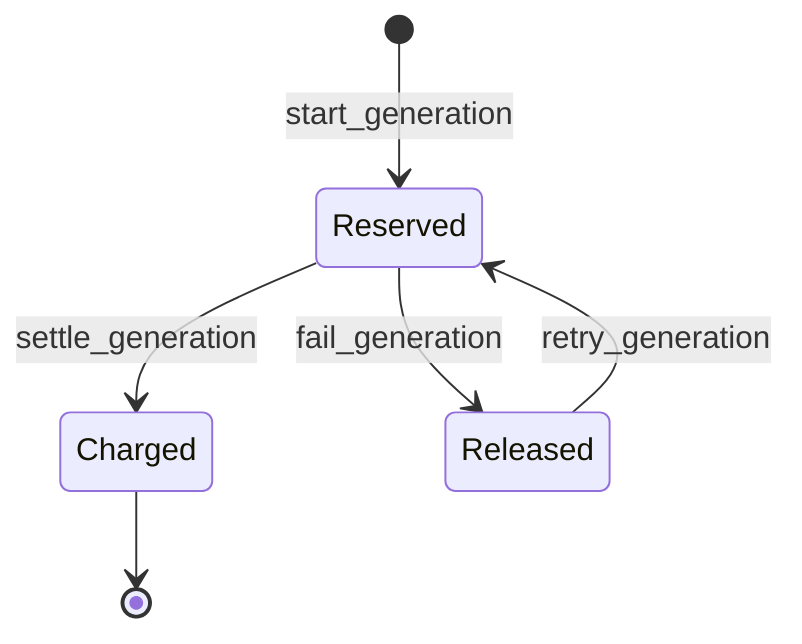

# Database and security model

## Core records

- Identity: `profiles`, `user_roles`
- Presentations: `presentations`, `slides`, `slide_elements`, `presentation_assets`, `presentation_sources`
- Generation: `generation_jobs`, `generation_steps`, `ai_usage`, `api_rate_limits`
- Billing: `credit_wallets`, immutable `credit_transactions`, database-driven `style_configs` and `app_settings`
- Delivery: `export_jobs`, `presentation_edit_history`
- Governance: immutable `admin_audit_logs`

All user-facing records use UUIDs, timestamps, constraints and indexed foreign keys. Presentation children store both presentation and owner IDs and use composite relationships so records cannot be attached across owners.

## Credit transaction lifecycle

`start_generation` locks the wallet, estimates cost from active style configuration, checks available balance, creates a reservation transaction, and returns the job. Its idempotency key prevents duplicate reservations. Success settles the reservation against actual credits; failure releases it. Wallet and ledger changes occur atomically in PostgreSQL.

Admins adjust credit through `admin_adjust_credits`, which locks the wallet, prevents negative available balance, writes an immutable transaction, and writes `admin_audit_logs` before commit.

## RLS matrix

| Data | User | Admin | Service role |
|---|---|---|---|
| Own presentation graph | Select own rows | Select all | Server pipeline |
| Own wallet/ledger | Select own rows | Select all | Atomic functions |
| AI/export/edit records | Select own rows | Select all | Workers |
| Styles/public settings | Select active/public | Select all | Workers |
| User roles/audit | Own role / no audit | Select all | Governance |

Direct client inserts/updates are minimized. Generation, editing, exports and billing use checked RPCs or Edge Functions. Admin privileges never come from client claims or hidden UI.

## Data collection

The survey module adds its own tables, policies and functions; see
[data collection](data-collection.md) for the full contract. Two properties cut
across the schema and belong here: a response is written only by
`submit_survey_response()` — clients hold no INSERT privilege on
`survey_responses` or `survey_answers` — and every response carries an
`expires_at` that a scheduled sweep enforces. Admins can read a survey's
metadata for moderation and cannot read its answers at all.

## Storage

Six private buckets are migrated and reproducible: `user-uploads`, `presentation-assets`, `generated-images`, `exports`, `thumbnails`, and `survey-uploads` (3 MB, images only, paths shaped `<respondent_id>/<form_id>/<file>`). Bucket-specific MIME and size constraints apply. User policies require paths shaped as `<auth.uid()>/...`; server outputs follow the same convention.

## Migration safety

Replay locally with `npx supabase db reset --local`. Validate with `npx supabase db lint --local --level warning` and `npx supabase test db`. Never use reset against a linked remote project; ship reviewed forward migrations with `db push`.
